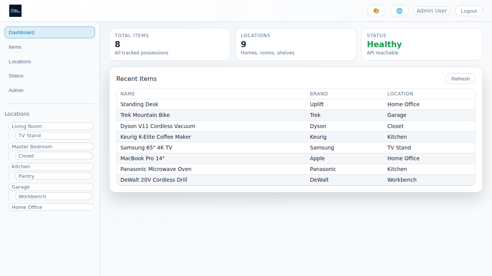
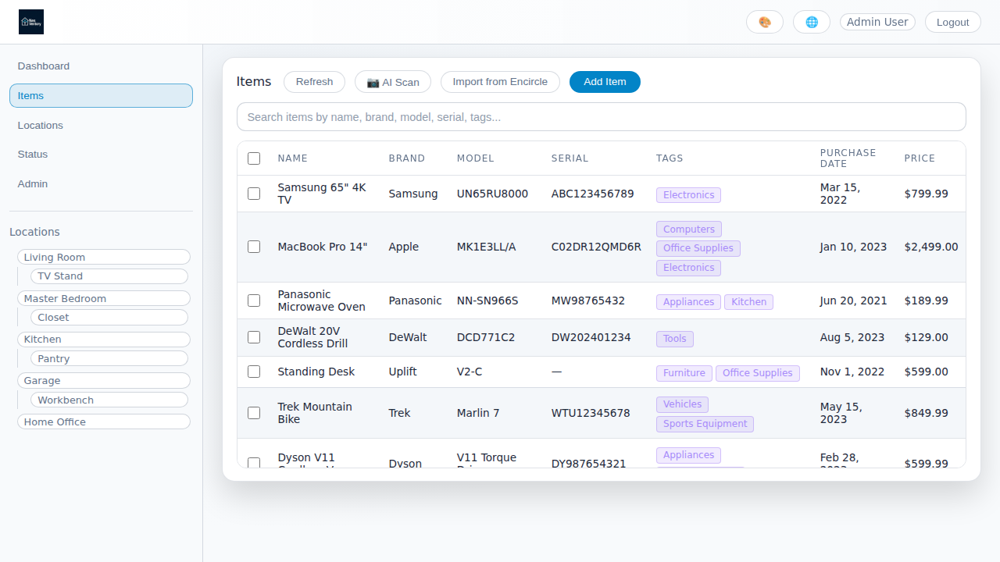
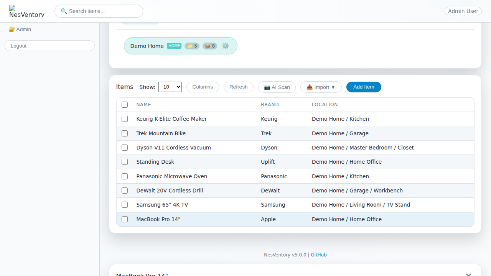

# NesVentory - Home Inventory Management System

**Version: 4.2.0**

NesVentory is a modern home inventory management application that helps you track and organize your household items, their locations, warranties, and maintenance schedules.

## 🚀 What's New in Version 4.2.0

This release adds QR code label printing for locations and container support for boxes and bins.

### ✨ Key Features in v4.2

📱 **QR Code Label Printing**
- Generate QR code labels for any location
- Print labels for boxes, bins, and storage containers
- Multiple label sizes supported (2"x1" to 4"x6")
- Compatible with thermal label printers (Dymo, Brother, Zebra)
- Optional item list printed on label
- Seasonal holiday icons for decoration

📦 **Container Location Support**
- Mark locations as containers (boxes, bins, cases)
- Visual "BOX" badge on container locations
- Scan QR code to see all items in a container
- Perfect for seasonal storage organization

🤖 **Android App Support (Planned)**
- Future support for scanning QR codes via mobile app
- Quick container contents viewing on the go

## 🚀 What's New in Version 4.0.0

This is a major release preparing NesVentory for public release with comprehensive features, improved security, and a polished user experience.

### ✨ Key Features in v4.0

🎨 **Logo & Branding Support**
- Application logo displayed in header and login screen
- Customizable branding for deployments

📷 **AI Photo Detection** (Google Gemini Powered)
- Take a photo of any room and AI will detect items automatically
- Advanced object recognition for furniture, electronics, appliances, and more
- Get estimated values and descriptions for detected items
- Bulk add detected items to your inventory
- Mobile device camera support

🤖 **AI Data Tag Parsing**
- Extract item information from data tag photos using AI
- Automatically parse manufacturer, model, serial number, and more
- Quick inventory creation from product labels

💰 **AI Value Estimation**
- Set estimated values using AI with source tracking
- Track when values were estimated and by whom

🎨 **Theme & Color Support**
- Customizable theme settings in user preferences
- Dark/light mode support

📍 **Hierarchical Location Browser**
- Interactive clickable location navigation
- Visual location tree with expand/collapse functionality

👥 **Enhanced User Management**
- Google OAuth SSO for login and registration
- Admin user creation and approval workflow
- Role-based access control (Admin, Editor, Viewer)
- Location-based access restrictions

📦 **Bulk Operations**
- Multi-select items for bulk actions
- Bulk delete, tag update, and location assignment
- Left-aligned action bars for better UX

📥 **Encircle Import**
- Import items and photos from Encircle XLSX exports
- Parent/sub-location hierarchy support
- Automatic location creation from import files

## Features

- 📦 **Inventory Management** - Track all your household items with detailed information
- 📷 **AI Photo Detection** - Scan rooms with AI to detect and add items automatically
- 🤖 **AI Data Tag Parsing** - Extract product info from data tag photos
- 📍 **Location Hierarchy** - Organize items by rooms and sub-locations
- 📱 **QR Code Labels** - Print QR labels for locations and containers
- 📦 **Container Support** - Mark locations as boxes/bins for seasonal storage
- 🏘️ **Multi-Property Support** - Manage multiple homes and multi-family properties
- 👥 **Landlord/Tenant Management** - Track landlord and tenant info for rental properties
- 📥 **Encircle Import** - Import items and photos from Encircle XLSX exports
- 🔐 **Multi-user Support** - Role-based access control (Admin, Editor, Viewer)
- 🔑 **Google OAuth SSO** - Sign in with Google for easy authentication
- 🔒 **Location Access Control** - Restrict user access to specific properties
- 🛠️ **Maintenance Tracking** - Schedule and track recurring maintenance tasks
- 🌐 **International Formats** - Support for 25+ locales and 20+ currencies
- 📱 **Modern UI** - Responsive React frontend with TypeScript
- 🚀 **FastAPI Backend** - High-performance Python backend
- 🗄️ **SQLite Database** - Simple, embedded, file-based storage
- 🐳 **Docker Ready** - Easy deployment with single unified container
- 🎯 **Pre-seeded Test Data** - Start testing immediately with sample data

## Tech Stack

- **Backend**: FastAPI (Python 3.11)
- **Frontend**: React + TypeScript + Vite (built and served by backend)
- **Database**: SQLite (embedded, file-based)
- **Containerization**: Docker (single unified container)

## 📸 Screenshots

### Login Screen

### Dashboard

### Items List

### Item Details

## 🚀 Getting Started

**For complete installation instructions, see [INSTALL.txt](INSTALL.txt)**

### 🔑 Default Login Credentials

The application comes with pre-seeded test users:

| Role | Email | Password | Access Level |
|------|-------|----------|--------------|
| **Admin** | admin@nesventory.local | admin123 | Full access |
| **Editor** | editor@nesventory.local | editor123 | Create/modify items |
| **Viewer** | viewer@nesventory.local | viewer123 | Read-only |

⚠️ **Important**: Change these credentials for production use!

## 📚 Documentation

- **[INSTALL.txt](INSTALL.txt)** - Comprehensive installation guide with Docker Compose and CLI commands
- **[SEEDING.md](SEEDING.md)** - Details about pre-seeded test data and how to customize it
- **[INTERNATIONALIZATION.md](INTERNATIONALIZATION.md)** - Guide to international format support for dates and currencies

## 📄 License

This project is open source. See the [LICENSE](LICENSE) file for details.

## 🤝 Contributing

Contributions are welcome! Please feel free to submit issues and pull requests.

### Commit Message Guidelines

This project uses [Conventional Commits](https://www.conventionalcommits.org/) to standardize commit messages. All commits in pull requests are automatically checked.

Please use one of the following prefixes for your commit messages:

- `feat:` - A new feature (e.g., `feat: add user profile page`)
- `fix:` - A bug fix (e.g., `fix: resolve login timeout issue`)
- `docs:` - Documentation changes (e.g., `docs: update installation guide`)
- `chore:` - Maintenance tasks (e.g., `chore: update dependencies`)
- `BREAKING CHANGE:` - A breaking API change (can also be indicated with `!` after the type, e.g., `feat!: remove legacy API`)

Other valid prefixes include: `style:`, `refactor:`, `perf:`, `test:`, `build:`, `ci:`, `revert:`

## 📞 Support

For issues and support, please visit:
https://github.com/tokendad/NesVentory/issues
